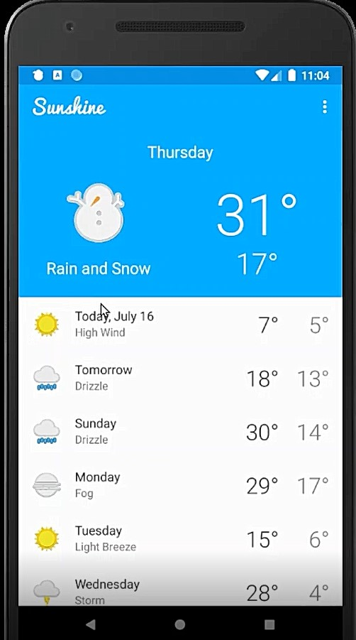
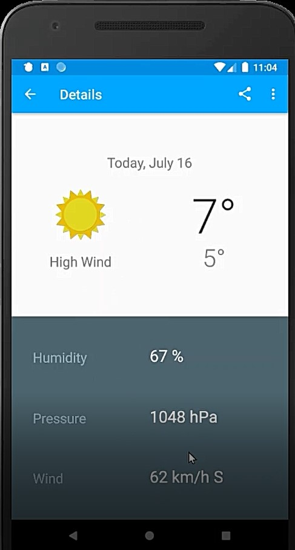
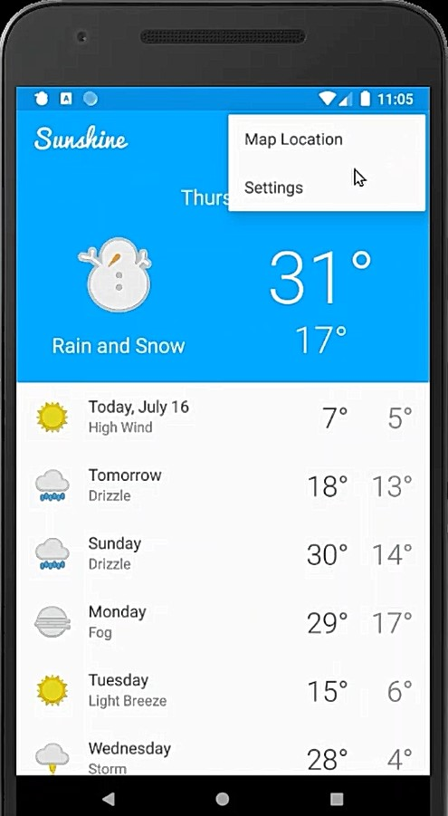
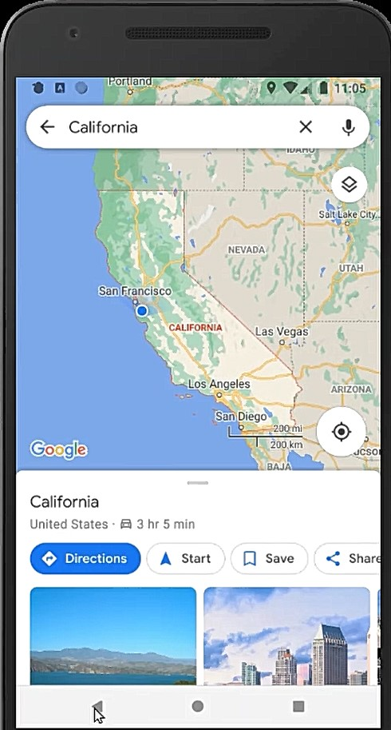
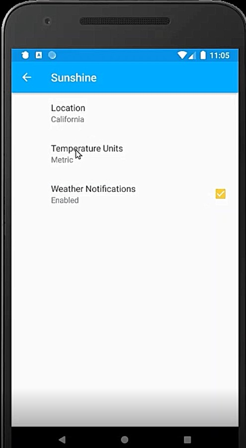
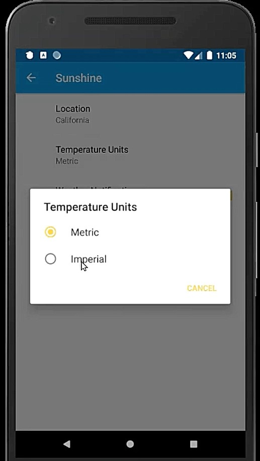
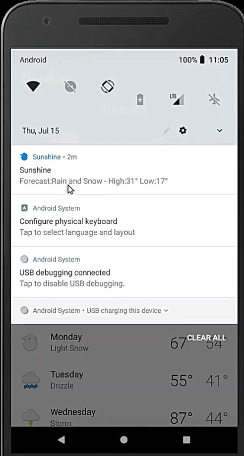
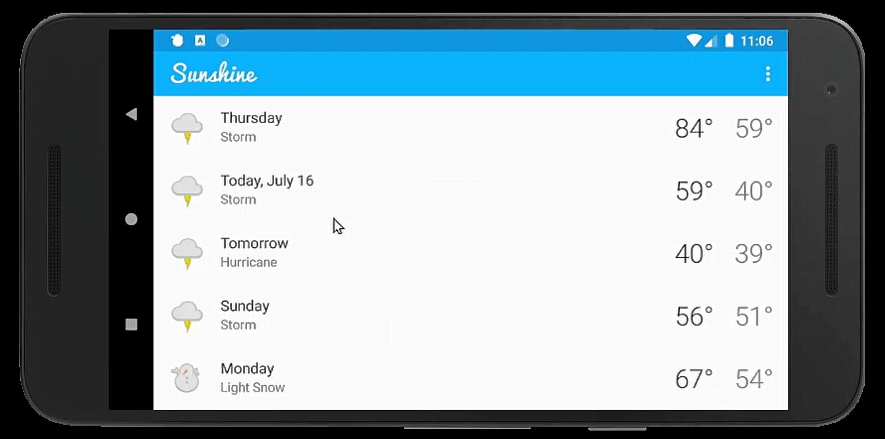
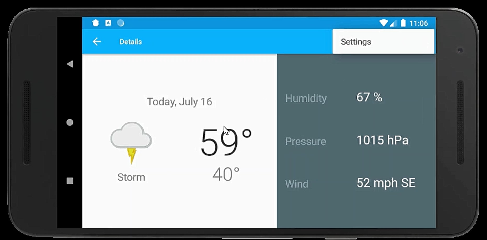

# Sunshine
-----

Sunshine weather app is simple ,light and efficient app displays Weather forecast for the next 7 days.
Including High / Low temperatures, humidity levels, wind speed and atmospheric pressure.
and Ability to share the weather forecast with your friends and family via your own messaging / email apps,
Also having a different layout for the tablets,Sunshine pops a notification whenever the weather predictions change.
A simple Android app, that helps user to monitor weather. App automatically synchronizes after certain time interval and gives weather 
forecast for the next 7 days. Including High / Low temperatures, humidity levels, wind speed and atmospheric pressure. You can 
share weather information to your near ones using available mailing apps or messaging apps. 
A great companion to your everyday weather needs. This app was developed as part of the Udacity course on Android development. 
Through This app i learn advance concepts and features of Android frameworks.

Features:
------
Monitor daily weather info along with High / Low temperatures, humidity levels, wind speed and atmospheric pressure
Uses Open Weather API for getting weather information
Uses GCM, ContentProvider, Cursorloader, SyncAdapter for syncing data
Ability to share the weather forecast with your friends and family via your own messaging / email apps.
Applied material design concepts - Parallax effect,Recyclerview, Ripple effect, Cardview, Screen transition, Object Animation
User can select desired location using postal code / map
Widget support
Phone and tablet resolution support

Screenshots
-----------

Lessons Learned :
---------
1. Android Studio, Gradle, and debugging tools
2. User Interface and Layout managers
3. ListViews and Adapters
4. Threading and ASyncTask
5. HTTP requests on web APIs
6. Android Permission System
7. Parsing Json response [used Google Gson library]
8. Explicit and Implicit Intents
9. Shared Preferences and PreferenceActivity
10. Intent Resoultion and Intent Filters
11. Use [Fragments](https://developer.android.com/training/basics/fragments/index.html) to support single and multi pane layouts
11. Read local large json files "[How To Read Large Json Files Using Gson](https://computersciencegeeks.wordpress.com/2017/08/16/read-large-json-files-using-gson/)"
12. Using [Room](https://developer.android.com/topic/libraries/architecture/room.html) for cashing cities list in local database
(Through these App I learn about Android Software Stack,Activities, Packages,Layouts,Visual Layout Editor,Responsive Design,Layout Managers

Resources,On Menus,Build URL,Fetching an HTTP Request,Permissions,Threads,AsyncTask,JSON Format,Parse JSON,Networking

RecyclerView,Items and ViewHolders,findViewByld() Calls,Adapters,Layout Manager,Intents Framework,Passing Data 

Between Activities,Implicit or Explicit Intents,Parts of URIs,Map Intent,Media Types,Send Data to activity,Android 

Activity Lifecycle,Lifecycle Events,Persisting Data,Preparing for Termination,AsyncTask and Loaders,Leveraging 

Loaders,Caching with Loaders,Preference Fragments,Reading From SharedPreferences,Preference Change Listener,

List or EditText Preference,Preference Summary,Content Providers,Content Provider Permissions,The Content Resolver,

Uniform Resource Identifier,Structure of the Data,Cursor,Using a CursorLoader,Room,Entity,DAO,Type Converters,

Threads and Runnables,Executors,Queries with Parameters,LiveData and the Observer Pattern,ViewModel,LifecycleOwners 

and LifecycleObservers,Services,Services vs. Loaders,Running Services in the Background,Intent Services,

Notifications,Pending Intents,Notification Actions,Foreground Services,Scheduling Jobs,JobService,

,Schedule with FirebaseJobDispatcher,Broadcast Receivers,Synchronizing,Views & View Groups,Constraint Layout,

Adding Shapes and Images,Data Binding,Accessibility & Internationalization,Localization,Landscape Layout,

Android Design Principles,Visual Mocks and Keylines,Colors and Fonts,Styles and Themes,Screen Density,Touch Selectors

Tablet Layout,Smallest Width Qualifier)
